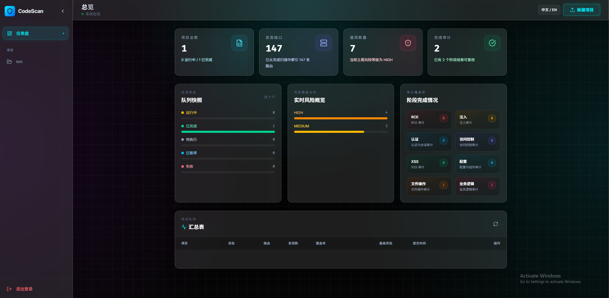
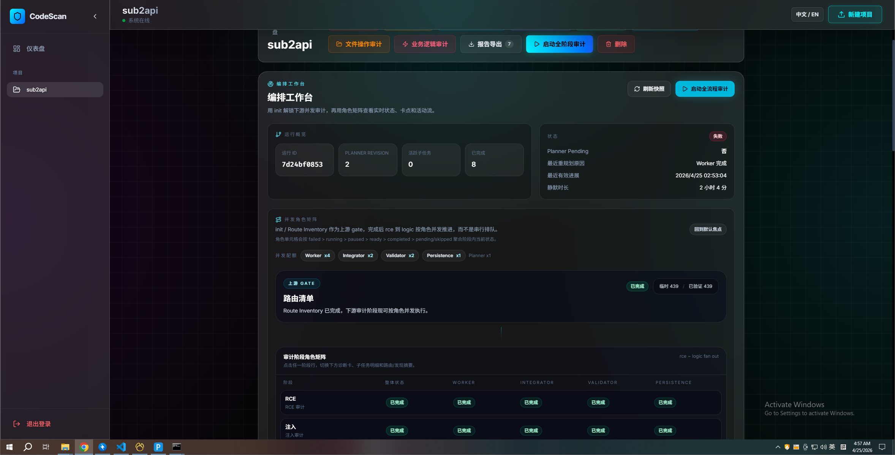
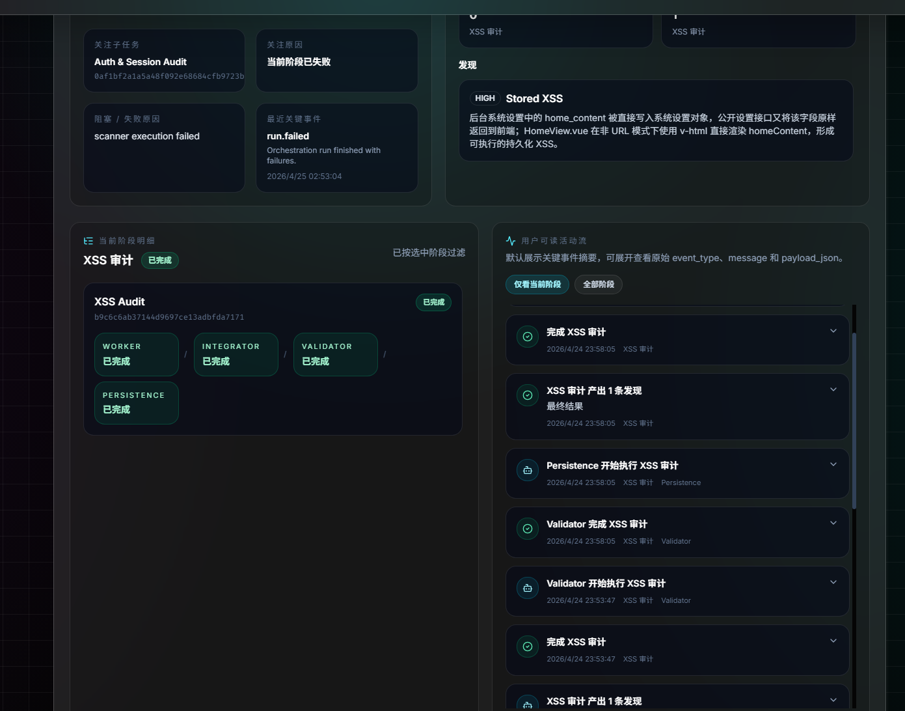
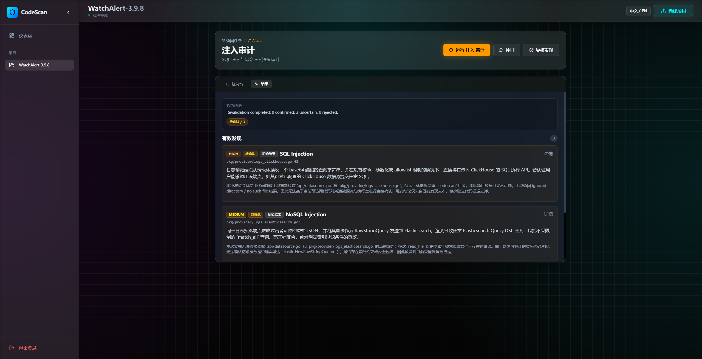
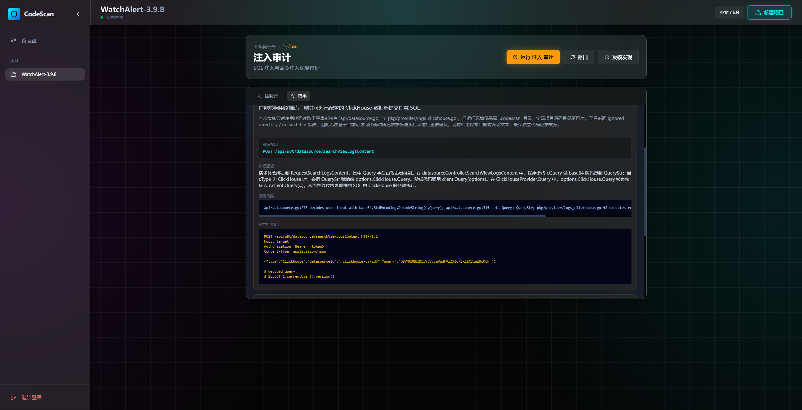

# CodeScan

CodeScan 是一个面向源码安全审计场景的 Go + Vue 平台，支持项目上传、路由梳理、分阶段漏洞审计、结果复核与 HTML 报告导出。

当前版本已经切到基于 LangGraph 的审计编排，把“路由识别 -> 阶段专项扫描 -> 每个阶段单独验证漏洞有效性 -> 汇总复核 -> 报告导出”做成一套可持续操作的审计工作台。

## 核心特点

- 仪表盘总览：集中查看项目数量、接口规模、漏洞数量、审计完成情况与风险分布。
- 路由分析：先梳理项目路由，再进入具体审计阶段，减少盲扫。
- LangGraph 编排：由初始化阶段先沉淀路由与模块线索，再驱动后续阶段专项扫描与验证链路。
- 多阶段审计：支持 `RCE`、`注入`、`认证与会话`、`访问控制`、`XSS`、`配置与组件`、`文件操作`、`业务逻辑` 等阶段化审计。
- 结果复核：每个阶段的发现都会进入独立验证流程，区分确认与不确定结果，便于持续收敛误报。
- 细节下钻：可查看漏洞描述、调用链、触发接口、HTTP POC 等详细信息。
- 报告导出：支持导出整合后的 HTML 报告，方便交付与留档。
- 开源发布保护：内置发布检查，避免把 `config.json`、任务数据、用户上传项目、本地报告和构建产物误传到 GitHub。

## 界面演示

### 1. 总览仪表盘



展示系统运行状态、项目总数、发现接口数、漏洞数量、完成审计数量，以及风险等级和阶段完成情况。

### 2. LangGraph 编排工作台





新版工作台已经切到 LangGraph 编排：先完成路由识别与初始化沉淀，再按阶段推进专项扫描；每个阶段都会单独执行漏洞有效性验证，最后再汇总到面板与报告中。

### 3. 注入审计结果总览



在具体审计阶段内，可以集中查看有效发现、风险等级、复核状态，以及每条问题的核心说明。

### 4. 漏洞详情与 HTTP POC



支持下钻查看漏洞触发接口、关键执行逻辑、调用链片段与 HTTP POC，方便验证与复测。

## 技术栈

- 后端：Go
- 前端：Vue 3 + Vite
- UI：Tailwind CSS
- 数据库：MySQL

## 快速开始

### 环境要求

- Go 1.23.3+
- Node.js 20+
- MySQL

### Ubuntu 升级 Go

如果 Ubuntu 环境中的 Go 版本过低，可以执行下面的命令升级到 `go1.23.3`：

```bash
cd /tmp && wget https://go.dev/dl/go1.23.3.linux-amd64.tar.gz && sudo rm -rf /usr/local/go && sudo tar -C /usr/local -xzf go1.23.3.linux-amd64.tar.gz && grep -qxF 'export PATH=/usr/local/go/bin:$PATH' ~/.bashrc || echo 'export PATH=/usr/local/go/bin:$PATH' >> ~/.bashrc && export PATH=/usr/local/go/bin:$PATH && go version
```

该命令适用于 Ubuntu，并会直接替换 `/usr/local/go` 下现有的 Go 安装。

### 1. 初始化后端

初始化本地目录与配置：

```bash
go run ./cmd/init
```

执行初始化后，程序会自动生成 `auth_key` 并写入本地 `data/config.json`，不需要手动在示例配置里填写固定值。

如果本地已经存在旧版 `data/config.json`，且仍保留已移除字段，`go run ./cmd/init` 会直接报错并指出具体字段路径，需要先清理旧 key 再继续。

启动后端：

```bash
go run .
```

### 2. 启动前端

```bash
cd frontend
npm install
npm run dev
```

如需打包前端：

```bash
cd frontend
npm run build
```

### 3. 可选安装 `rg`

代码搜索工具对上层仍保留 `grep` 接口名，但底层实现已经默认优先使用 `ripgrep (rg)`；如果系统里没有 `rg`，会自动回退到内置的 Go 扫描实现，不需要手动切换，只是性能和结果规模会相对保守一些。

常见安装方式：

```bash
# Ubuntu / Debian
sudo apt-get update && sudo apt-get install -y ripgrep

# macOS (Homebrew)
brew install ripgrep

# Windows (winget)
winget install BurntSushi.ripgrep.MSVC
```

## 配置说明

- 实际运行配置请保存在本地 `data/config.json`。
- 开源仓库中提供的是安全示例文件 `data/config.example.json`。
- `auth_key` 会在执行 `go run ./cmd/init` 时自动生成并写入本地配置文件。
- 配置解析为严格模式，未知字段或已移除字段会在启动时直接报错，不再静默忽略。
- 上下文限制仍支持通过 `scanner_config.context_compression` 配置 token 软/硬上限；字节回退阈值、摘要窗口、微压缩细节、编排心跳、角色并发等低价值调参已经内建到代码中。
- 当前支持的配置结构如下：

```json
{
  "auth_key": "...",
  "db_config": {
    "host": "127.0.0.1",
    "port": 3306,
    "user": "root",
    "password": "",
    "dbname": "codescan"
  },
  "ai_config": {
    "api_key": "replace-with-api-key",
    "base_url": "https://api.openai.com/v1",
    "model": "gpt-5.4"
  },
  "scanner_config": {
    "context_compression": {
      "soft_limit_tokens": 22000,
      "hard_limit_tokens": 34000
    },
    "session_memory": {
      "enabled": true
    }
  },
  "orchestration_config": {
    "enabled": true,
    "worker": {
      "model": ""
    },
    "validator": {
      "model": ""
    }
  }
}
```

- 后端支持通过环境变量覆盖关键配置，例如：
  - `CODESCAN_AUTH_KEY`
  - `CODESCAN_DB_PASSWORD`
  - `CODESCAN_AI_API_KEY`
- `data/config.json` 属于本地私有文件，不能公开发布。

## 开源发布安全

在推送代码或打包发布前，建议先执行内置检查：

```bash
go run ./cmd/release check
```

该检查会自动排除以下本地或产物内容：

- `data/config.json`
- `data/tasks.json`
- `projects/`
- `frontend/node_modules/`
- `frontend/dist/`
- `frontend/.cache/`
- `frontend/.vite/`
- `bin/`
- `release/`
- 本地生成的 `*-report-*.html` 审计报告
- 现有 `*.zip`、`*.exe` 等构建产物

如需导出开源发布包：

```bash
go run ./cmd/release export -out release/CodeScan-open-source.zip
```

导出过程会再次校验 ZIP 内容，避免把敏感配置和不应公开的文件打进去。
